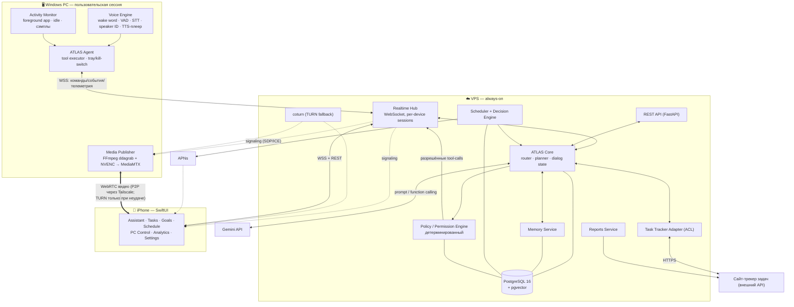
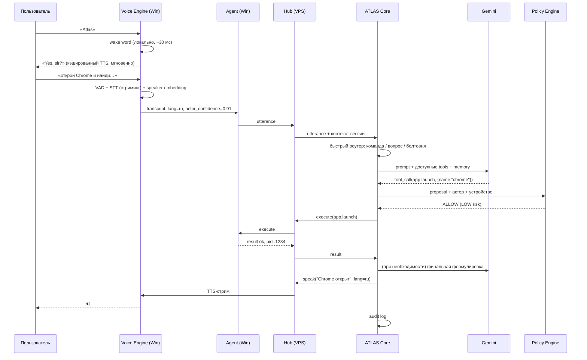
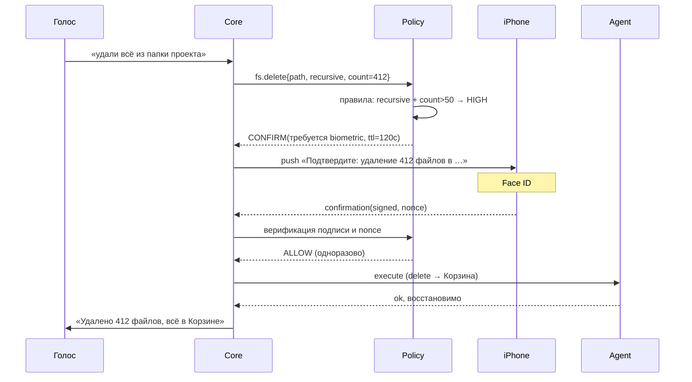
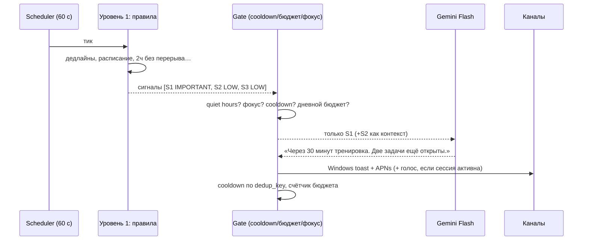

# ATLAS — PHASE 0: технический анализ и архитектура

> Статус: **на утверждение**. Код не пишется до подтверждения.
> Дата: 2026-08-12. Автор: архитектурный анализ по мастер-промпту.
>
> ⚠️ **Дополнено:** [PHASE-0.1-DECISIONS.md](PHASE-0.1-DECISIONS.md) — решения после ревью.
> Уточнены и **имеют приоритет** над этим документом: §15 (Task Tracker — код сайта меняем, API проектируем сами),
> §11 (STT — маршрутизация по языкам, code-switching), §19 (план фаз — перестроен под MVP-first).

## Карта соответствия запросу

| # | Запрошено | Раздел |
|---|---|---|
| 1 | Финальная архитектура | §5 |
| 2 | Технологический стек | §4 |
| 3 | Схема взаимодействия компонентов | §6 |
| 4 | Структура repository | §7 |
| 5 | API architecture | §8 |
| 6 | Database schema | §9 |
| 7 | Security architecture | §10 |
| 8 | Voice architecture | §11 |
| 9 | iOS architecture | §13 |
| 10 | Windows Agent architecture | §12 |
| 11 | Remote Control architecture | §14 |
| 12 | Task Tracker integration | §15 |
| 13 | Memory architecture | §16 |
| 14 | Proactive AI architecture | §17 |
| 15 | План разработки по фазам | §19 |
| 16 | Риски и ограничения | §2, §3 |
| 17 | Необходимые API/credentials | §20.1 |
| 18 | Что настроить вручную | §20.2 |
| 19 | Что я реализую сам | §20.3 |
| 20 | Что технически невозможно | §2 |
| + | Противоречия в требованиях | §1 |
| + | Мониторинг и отчёты | §18 |
| + | Открытые вопросы | §21 |

---

## 0. Исходные данные среды (снято с машины)

| Параметр | Значение | Следствие для архитектуры |
|---|---|---|
| CPU | AMD Ryzen 5 5600H, 6C/12T | Достаточно для агента + локального STT на CPU в крайнем случае |
| RAM | 15.4 GB | Ограничение: не держать большие модели резидентно |
| GPU | NVIDIA RTX 3060 Laptop, **6 GB VRAM**, драйвер 580.97 | CUDA для faster-whisper; **NVENC H.264/HEVC** для стрима экрана. AV1-энкодера нет (Ampere) |
| iGPU | AMD Radeon (Cezanne) | Гибридная графика — Desktop Duplication надо привязать к правильному адаптеру |
| OS | Windows 11 Pro 26200 | Windows.Graphics.Capture доступен, современный API |
| Python | **3.14.0** | ⚠️ ML-стек (torch/ctranslate2/onnxruntime) для 3.14 неполный → проект пиним на **3.12** |
| Node | установлен | Не понадобится (кроме возможных тулов сайта) |
| git | установлен | ok |
| ffmpeg / docker / uv / psql | **отсутствуют** | Нужна ручная установка, см. §20.2 |

Ноутбук — значит: тепловой и батарейный бюджет ограничен, GPU иногда занят. Всё локальное GPU-потребление (STT + NVENC) должно быть опциональным и деградировать на CPU/облако.

---

## 1. Анализ требований: противоречия и их разрешение

Ниже — реальные конфликты в ТЗ. Каждый закрыт архитектурным решением, а не обходом.

### 1.1 «Wake word Atlas» + «iPhone» ↔ iOS не даёт always-on микрофон
iOS не позволяет приложению постоянно слушать микрофон в фоне. Фоновый режим `audio` предназначен для воспроизведения/VoIP; произвольная запись в фоне глушится системой, жрёт батарею и не переживает выгрузку.
**Решение:** три уровня активации на iPhone —
1. **Foreground wake word** — полноценный, пока приложение открыто.
2. **Listening Session** — пользователь явно включает режим, приложение удерживает `AVAudioSession` с фоновым режимом. Работает «пока работает», без гарантий. Честно помечено в UI.
3. **Siri App Intent** — «Привет, Siri, Атлас» → системный путь, работает всегда, но это Siri, а не наш wake word.
Проактивность на iPhone идёт **только** через APNs push с сервера, а не через фоновую активность приложения.

### 1.2 «Gemini не должен иметь доступ к Windows» ↔ «CV по скриншотам для поиска элементов»
Отправка скриншота в Gemini — это и есть передача содержимого экрана Google. Прямое противоречие.
**Решение — UIA-first:** основной способ находить элементы («нажми на Downloads») — **Windows UI Automation tree** (имена, роли, `BoundingRectangle`). Это надёжнее пикселей, работает без отправки чего-либо наружу и не ломается от смены темы/разрешения. Vision-модель — **фоллбэк**, срабатывает только когда UIA не дал однозначного результата, и при этом:
- скриншот проходит **редакцию** (denylist процессов/окон: банки, менеджеры паролей, приватные вкладки — такие окна вырезаются чёрным);
- факт отправки пишется в audit log и показывается в трее;
- отправляется по возможности **окно, а не весь экран**;
- есть глобальный тумблер «разрешить vision» (по умолчанию — спросить один раз на сессию).

### 1.3 «Голос: британский мужской» ↔ «ответы на русском и казахском»
Британский акцент существует только в английском. На русском/казахском «британский мужской голос» физически невозможен.
**Решение:** голосовая идентичность ATLAS определяется как *набор характеристик* (мужской, средне-низкий, спокойный, чёткая дикция, сдержанный) и маппится на лучший доступный голос **для каждого языка**: `en-GB` — британский мужской; `ru-RU` — мужской нейтральный близкого тембра; `kk-KZ` — доступный мужской нейронный голос (выбор крайне ограничен). Тембр не будет идентичен между языками — это ограничение реальности, а не реализации. Оригинальный голос, без имитации конкретного актёра.

### 1.4 «Не дублируй систему задач» ↔ «работать при недоступном сайте / офлайн»
**Решение:** сайт — **source of truth**. ATLAS держит **проекцию (кэш) + очередь исходящих изменений**, а не вторую систему. Запись — write-through с idempotency key; при недоступности сайта команда ставится в outbox и реплеится. ATLAS **владеет** только тем, чего в трекере нет (напоминания, cooldown-состояние, отчёты, память) — и это отдельные сущности, а не дубли задач.

### 1.5 «Voice verification» ↔ «это не защита»
Вы это уже отметили; закрепляю как жёсткое правило: **голос никогда не является авторизацией**. Он даёт `actor_confidence` (0..1), который влияет на risk score. Любое MEDIUM/HIGH действие требует **out-of-band подтверждения** (Face ID на iPhone или подтверждение в трее Windows). Голосовой канал уязвим к записи и к TTS-клонированию — считаем его скомпрометированным by design.

### 1.6 «Проактивные уведомления» ↔ «не беспокоить постоянно» ↔ «стоимость LLM»
Если каждый тик гонять Gemini — это и спам, и деньги.
**Решение:** двухуровневый Decision Engine. Уровень 1 — детерминированные правила (дёшево, каждую минуту) генерируют *сигналы*. Уровень 2 — LLM вызывается **только** когда сигналы прошли gate, и обрабатывает их **батчем** (склеивает в одно сообщение). Плюс бюджет уведомлений в день. См. §17.

### 1.7 «Единое состояние ATLAS на всех устройствах»
**Решение:** backend — единственный владелец состояния. Устройства не синхронизируются между собой напрямую; они подписаны на серверный поток событий с курсором. Локальный кэш на устройстве — read model, любое изменение идёт через сервер.

### 1.8 «Production-oriented код» ↔ система на одного пользователя
Не надо строить Kubernetes для одного человека. **Решение:** production-качество = типизация, тесты, миграции, аудит, обработка ошибок, документация. Но **не** горизонтальное масштабирование, не мультитенантность, не Kafka. Один VPS, один процесс backend, Postgres без реплик. При этом `user_id` в схеме есть — чтобы мультипользовательность не потребовала переписывания.

---

## 2. Ограничения платформ: что невозможно или ограничено

Это раздел «не имитируй работающую функцию». Всё нижеперечисленное — жёсткие ограничения ОС, не лень реализации.

### Windows

| Ограничение | Почему | Что можно вместо |
|---|---|---|
| **Нельзя подтверждать UAC-диалоги** | UAC рисуется на Secure Desktop; синтетический ввод туда не доставляется в принципе | Только предупредить пользователя: «нужно ваше подтверждение на экране» |
| **Нельзя слать ввод в окна процессов с более высокой целостностью** | UIPI: non-elevated процесс не может `SendInput` в elevated-окно | Агент по умолчанию работает **без** админ-прав (это фича). Опционально — отдельный elevated-хелпер для явно разрешённых операций |
| **Нельзя управлять/смотреть экран при заблокированной Windows** | Нет интерактивной сессии, Secure Desktop | Wake-on-LAN + включение — можно. Разблокировка — **нет** (и не должно быть) |
| **Агент не может быть Windows-службой** | Службы в Session 0, без доступа к рабочему столу пользователя | Процесс в пользовательской сессии, автозапуск через Task Scheduler «At log on» |
| **Температура CPU** | `MSAcpi_ThermalZoneTemperature` часто не реализована / врёт; точные датчики требуют драйвера с админ-правами | GPU-температура — через `nvidia-smi` (работает). CPU — «недоступно» либо опциональный LibreHardwareMonitor с админом |
| **AV1 hardware encode** | RTX 3060 = Ampere, AV1 только декодирование | H.264 / HEVC через NVENC — их достаточно |
| Антивирус/EDR может флагать агента | Инжект ввода + захват экрана + хуки = поведение как у RAT | Подписать бинарь, добавить исключение вручную, не использовать хуки там, где хватает polling |

### iOS

| Ограничение | Почему | Что можно вместо |
|---|---|---|
| **Нет always-on wake word в фоне** | iOS не даёт фоновой записи произвольным приложениям | См. §1.1: foreground / listening session / Siri App Intent |
| **Нельзя управлять другими iOS-приложениями** | Песочница | Shortcuts / App Intents / URL schemes; EventKit (Календарь, Напоминания), HealthKit (чтение) — по разрешениям |
| **Стрим экрана ПК останавливается при сворачивании приложения** | Фоновое выполнение ограничено | Автопауза стрима, мгновенное переподключение при возврате |
| **Push-уведомления требуют платного Apple Developer Program** | APNs-ключи выдаются только там | $99/год. Без него — нет проактивности на iPhone |
| **Без Apple Developer Program сборка живёт 7 дней** | Free provisioning | Пересборка раз в неделю либо платный аккаунт |
| Нет App Store-дистрибуции | Личное приложение | Установка через Xcode / TestFlight (только с платным аккаунтом) |

### Общее

| Ограничение | Комментарий |
|---|---|
| **Полный офлайн-режим невозможен** | Gemini — облако. Деградация: локальный intent-matcher выполняет ~30 самых частых команд без LLM, остальное — «нет связи» |
| **Казахский язык** | Whisper знает `kk`, но качество заметно ниже, чем ru/en. Облачный STT (Google/Azure) для `kk-KZ` лучше. TTS для `kk-KZ` — выбор голосов очень узкий |
| **Speaker verification** | Практический EER 1–3 % на чистом ближнем аудио, деградирует на расстоянии/шуме. Не защита |
| **Wake word «Atlas»** | Два слога, распространённое слово → повышенный false-accept. Рекомендую поддержать и «Atlas», и «Hey Atlas» с разными порогами |

---

## 3. Технические риски

| # | Риск | Вероятн. | Влияние | Митигация |
|---|---|---|---|---|
| R1 | Task tracker API неизвестен / отсутствует | Высокая | Блокирует Phase 9 | Anti-corruption layer + фейковый адаптер, чтобы разработка не стояла. Нужны ответы §21.1 |
| R2 | Латентность голосового цикла > 2.5 с → ассистент ощущается тупым | Средняя | Высокое | Стриминговый STT, ранний роутинг на flash-модели, TTS-стрим первого чанка, кэш частых фраз |
| R3 | WebRTC не поднимается через NAT | Средняя | Среднее | Tailscale как основной путь + coturn TURN как fallback + tier-2 фоллбэк на кадры по WS |
| R4 | GPU занят игрой/другой задачей → STT и NVENC конкурируют | Средняя | Среднее | Профили: `gpu`/`cpu`/`cloud` для STT, автопереключение по загрузке |
| R5 | Ложные срабатывания wake word → случайные действия | Высокая | Среднее | Двухступенчатая верификация (KWS + подтверждение по STT-транскрипту), никакого auto-execute для MEDIUM+ |
| R6 | LLM «галлюцинирует» вызов опасного инструмента | Средняя | **Критическое** | Policy Engine — детерминированный, вне LLM. Whitelist инструментов, схемы аргументов, path scoping, удаление только в Корзину |
| R7 | Утечка содержимого экрана в Gemini | Средняя | Высокое | UIA-first, редакция, denylist, явное согласие, audit |
| R8 | Счета за API вырастают незаметно | Средняя | Среднее | Бюджет-лимитер в коде: дневной лимит токенов/символов TTS, счётчик в БД, hard stop + уведомление |
| R9 | Утечка ключей / компрометация VPS = удалённый доступ к ПК | Низкая | **Критическое** | Ключи в Secure Enclave/DPAPI, короткоживущие токены, подпись команд, kill switch, аудит, TLS |
| R10 | Python 3.14 несовместим с ML-зависимостями | Высокая | Низкое (известно заранее) | Пин 3.12 через uv |
| R11 | Xcode/Swift-код нельзя проверить с Windows | Точно | Среднее | Я пишу Swift, сборку и отладку делаете вы на Mac; закладываем цикл ревью |
| R12 | Scope creep — система огромная | Высокая | Высокое | Жёсткие фазы + «вертикальный срез» в Phase 2 для раннего рабочего результата |

---

## 4. Технологический стек (финальный)

### 4.1 Backend: **Python 3.12 + FastAPI** ✅

Обоснование (выбор между Python/FastAPI и TypeScript/Node):

1. **Windows Agent обязан быть на Python** (UIAutomation, pywin32, faster-whisper, speechbrain, onnxruntime — всё это Python-экосистема). Взяв Node на backend, мы получаем **два языка и два набора контрактов**, которые придётся синхронизировать вручную. С Python — один общий пакет `atlas-shared` с Pydantic-моделями протокола, импортируемый и backend, и агентом. Рассинхрон контрактов становится невозможен.
2. Голос, эмбеддинги, CV, аудио-обработка — Python-only.
3. Слабость Python — медиа-обработка в реальном времени. Но в этой архитектуре **backend не трогает медиа вообще**: видео идёт P2P между Windows и iPhone, кодирование делает NVENC. Слабость не задевает нас.
4. Нагрузка — один пользователь, I/O-bound. GIL нерелевантен.
5. FastAPI: нативный async, WebSocket, Pydantic v2 (та же типизация, что в протоколе), OpenAPI-схема из коробки (пригодится для iOS-клиента).

Отвергнутая альтернатива: Node/TS дал бы лучший WS-экосистемный опыт и общий язык с сайтом-трекером — но ценой двуязычия с агентом. Не окупается.

### 4.2 Полный стек

| Слой | Технология | Комментарий |
|---|---|---|
| Язык backend/agent | Python **3.12** | Не 3.14 — ML-стек |
| Пакетный менеджер | **uv** (workspace) | Быстро, monorepo-workspaces, lock-файл |
| Web framework | FastAPI + uvicorn | REST + WS |
| Валидация/модели | Pydantic v2 | Общие DTO протокола |
| ORM / миграции | SQLAlchemy 2.0 (async) + Alembic | Типизированный 2.0-стиль |
| БД | **PostgreSQL 16** + `pgvector` | Векторный поиск памяти без отдельной БД |
| Очередь/шина | Postgres `LISTEN/NOTIFY` + таблица jobs с `FOR UPDATE SKIP LOCKED` | Redis не нужен на одного пользователя — минус компонент |
| Планировщик | Собственный воркер поверх таблицы `scheduled_jobs` | Переживает рестарт, в отличие от in-memory APScheduler |
| AI | **Gemini API** через абстракцию `LLMProvider` | Pro-модель для reasoning/отчётов, Flash — для роутинга/классификации. Конкретные model id — в конфиге |
| Эмбеддинги | `EmbeddingProvider`: Gemini embeddings ↔ локальная multilingual-e5 | Мультиязычность важна |
| STT | `STTProvider`: faster-whisper (CUDA/CPU) ↔ облачный (для `kk`) | |
| TTS | `TTSProvider`: облачный neural (осн.) ↔ Piper (офлайн-фоллбэк) | Кэш по хэшу текста |
| Wake word | openWakeWord (ONNX) — основной; Porcupine — альтернатива | См. §11 |
| Speaker ID | SpeechBrain ECAPA-TDNN embeddings | Косинусная близость |
| Windows API | pywin32, `uiautomation`, `psutil`, ctypes-обёртка `SendInput` | Без pyautogui — он неточен с раскладками/скан-кодами |
| Захват экрана | `windows-capture` (WGC) для скриншотов; FFmpeg `ddagrab` для стрима | |
| Кодирование видео | FFmpeg + `h264_nvenc` (low-latency preset) | |
| Медиа-шлюз | **MediaMTX** (локально на Windows, запускается агентом) | RTSP-in → WebRTC/WHEP-out |
| WebRTC на iOS | `WebRTC-SDK` (stasel) через SPM | |
| Сеть | **Tailscale** (осн. путь) + coturn TURN (fallback) | Windows не выставляется в интернет |
| iOS | Swift 6 + SwiftUI, `async/await`, Observation | iOS 17+ |
| iOS хранение | SwiftData (кэш) + Keychain + Secure Enclave | |
| Push | APNs (token-based, `.p8`) | |
| Reverse proxy / TLS | Caddy | Авто Let's Encrypt |
| Тесты | pytest + pytest-asyncio + testcontainers (Postgres); XCTest на iOS | |
| Качество кода | ruff, mypy (strict на `shared` и `core`), pre-commit | |
| Логи | structlog → JSON; аудит — отдельная append-only таблица | |

---

## 5. Финальная архитектура



**Ключевой принцип потоков управления:**

```
Пользователь (голос/текст, любое устройство)
   → ATLAS Core (понимание намерения, Gemini)
   → предложение вызова инструмента (tool call)
   → Policy Engine (детерминированное решение: ALLOW / CONFIRM / DENY)
   → [при CONFIRM: out-of-band подтверждение на устройстве]
   → Windows Agent (исполнение)
   → результат → Core → ответ пользователю + audit log
```

Gemini **никогда** не вызывает инструменты напрямую. Он возвращает *предложение*. Между предложением и исполнением стоит слой, который сам по себе LLM не использует и покрыт юнит-тестами.

**Разделение плоскостей:**
- **Control plane** (команды, состояние, задачи, память) — через VPS. Надёжность важнее задержки.
- **Media plane** (видео экрана) — P2P Windows↔iPhone. Задержка важнее всего, трафик не должен идти через VPS.
- **Input plane** (мышь/клавиатура при удалённом управлении) — отдельный низколатентный WS-канал, но всё равно через Hub (для аудита и авторизации). Событий мало, задержка Hub приемлема; при включённом Tailscale Hub физически рядом по сети.

---

## 6. Схемы взаимодействия (основные сценарии)

### 6.1 Голосовая команда с Windows



### 6.2 Опасное действие



Отказ по таймауту — действие не выполняется. Подтверждение **не** переиспользуется для следующих команд.

### 6.3 Проактивное уведомление



---

## 7. Структура репозитория

Monorepo, uv workspace. Отличие от предложенного вами варианта: выделены `core` и `shared` как отдельные пакеты (Core переиспользуется в тестах и потенциально в офлайн-режиме агента), а тесты живут рядом с пакетами, а не в глобальном `/tests` — так их проще держать в актуальном состоянии.

```
atlas/
├── pyproject.toml                  # uv workspace root
├── uv.lock
├── README.md
├── .env.example
├── docs/
│   ├── PHASE-0-ARCHITECTURE.md     # этот документ
│   ├── adr/                        # architecture decision records
│   ├── protocol.md                 # спецификация WS-протокола
│   ├── tools.md                    # каталог инструментов + риск-классы
│   ├── security.md
│   └── runbook.md                  # эксплуатация, восстановление, kill switch
│
├── packages/
│   ├── atlas-shared/               # ← общий контракт, без побочных эффектов
│   │   ├── src/atlas_shared/
│   │   │   ├── protocol/           # Pydantic-модели WS-сообщений, версия протокола
│   │   │   ├── tools/              # манифесты инструментов + схемы аргументов
│   │   │   ├── enums.py            # RiskLevel, Priority, DeviceKind, Language
│   │   │   └── crypto.py           # подпись/верификация команд
│   │   └── tests/
│   │
│   ├── atlas-core/                 # ← «мозг»: без FastAPI и без БД-специфики
│   │   ├── src/atlas_core/
│   │   │   ├── llm/                # LLMProvider, GeminiProvider, промпты
│   │   │   ├── router/             # классификация намерения (дёшево, до LLM)
│   │   │   ├── dialog/             # состояние сессии, контекст, язык
│   │   │   ├── policy/             # ⚠️ Permission Engine (без LLM)
│   │   │   ├── memory/             # слои памяти, извлечение фактов
│   │   │   ├── decision/           # проактивные правила + gate
│   │   │   └── reports/            # daily briefing / evening summary
│   │   └── tests/
│   │
│   ├── atlas-backend/              # ← FastAPI, БД, интеграции, планировщик
│   │   ├── src/atlas_backend/
│   │   │   ├── api/                # REST-роутеры
│   │   │   ├── ws/                 # Hub, сессии устройств, роутинг сообщений
│   │   │   ├── db/                 # модели SQLAlchemy, репозитории
│   │   │   ├── auth/               # pairing, device auth, токены
│   │   │   ├── scheduler/          # воркер джобов
│   │   │   ├── integrations/
│   │   │   │   ├── tracker/        # ACL-адаптер сайта + fake-адаптер
│   │   │   │   └── apns/
│   │   │   ├── audit/
│   │   │   └── main.py
│   │   ├── migrations/             # Alembic
│   │   └── tests/
│   │
│   ├── atlas-voice/                # ← библиотека, используется агентом
│   │   ├── src/atlas_voice/
│   │   │   ├── wake/               # openWakeWord runner
│   │   │   ├── vad/                # Silero VAD, эндпоинтинг
│   │   │   ├── stt/                # STTProvider: local/cloud
│   │   │   ├── speaker/            # enrollment + verification
│   │   │   ├── tts/                # TTSProvider + кэш
│   │   │   └── pipeline.py         # конечный автомат голосовой сессии
│   │   └── tests/
│   │
│   └── atlas-agent-windows/        # ← локальный агент
│       ├── src/atlas_agent/
│       │   ├── transport/          # WS-клиент с реконнектом и очередью
│       │   ├── tools/              # реализации: apps, files, system, input, ui
│       │   │   ├── apps.py
│       │   │   ├── files.py
│       │   │   ├── system.py
│       │   │   ├── input.py        # SendInput-обёртка
│       │   │   ├── uia.py          # UI Automation: поиск элементов
│       │   │   └── screen.py       # захват, редакция
│       │   ├── monitor/            # активность, санитизация
│       │   ├── media/              # управление FFmpeg + MediaMTX
│       │   ├── safety/             # SAFE MODE, kill switch, path guard
│       │   ├── tray.py
│       │   └── main.py
│       └── tests/
│
├── ios/
│   └── Atlas/                      # Xcode-проект (собирается на Mac)
│       ├── Atlas/
│       │   ├── App/
│       │   ├── Features/           # Assistant, Tasks, Goals, Schedule,
│       │   │                       # PCControl, Analytics, Settings
│       │   ├── Core/               # networking, WS-клиент, auth, keychain
│       │   ├── Voice/              # SFSpeech, wake word, аудио-сессия
│       │   ├── RemoteControl/      # WebRTC, touchpad, клавиатура
│       │   └── Generated/          # DTO, сгенерированные из OpenAPI/протокола
│       └── AtlasTests/
│
├── infra/
│   ├── docker-compose.yml          # postgres + caddy + backend + coturn
│   ├── Caddyfile
│   ├── coturn/
│   └── deploy/                     # скрипты выката на VPS
│
└── scripts/
    ├── bootstrap_dev.ps1           # установка окружения на Windows
    ├── gen_ios_models.py           # генерация Swift DTO из Pydantic
    └── pair_device.py
```

Один общий источник правды по контрактам: `atlas-shared/protocol` → Python-стороны импортируют напрямую, Swift-модели **генерируются** скриптом. Ручного дублирования DTO нет.

---

## 8. API-архитектура

Два канала: **REST** для CRUD/настроек/истории, **WebSocket** для реального времени.

### 8.1 Конверт WS-сообщения

Единый формат для всех направлений:

```jsonc
{
  "v": 1,                       // версия протокола
  "id": "01J...",               // ULID сообщения
  "corr_id": "01J...",          // корреляция запрос↔ответ (опц.)
  "ts": "2026-08-12T10:31:02.123Z",
  "kind": "cmd | res | evt | err",
  "type": "agent.tool.execute",
  "payload": { },
  "sig": "base64(ed25519)"      // подпись для cmd в сторону агента
}
```

Правила: любой `cmd` требует `res` или `err` с тем же `corr_id`; таймаут по умолчанию 15 с (для долгих операций — `evt` с прогрессом); неизвестный `type` → `err(UNSUPPORTED_TYPE)`, соединение не рвётся; мажорное несовпадение `v` → отказ в подключении.

### 8.2 Типы сообщений

**Backend → Windows Agent**

| type | Назначение |
|---|---|
| `agent.tool.execute` | Выполнить инструмент (после Policy) |
| `agent.tool.cancel` | Отмена долгой операции |
| `agent.safe_mode.set` | Включить/выключить SAFE MODE |
| `agent.media.start` / `.stop` | Запустить/остановить стрим экрана |
| `agent.webrtc.signal` | SDP/ICE |
| `agent.input.batch` | Пакет событий ввода (удалённое управление) |
| `agent.speak` | Проиграть TTS |
| `agent.config.update` | Обновить настройки (мониторинг, языки, пороги) |

**Windows Agent → Backend**

| type | Назначение |
|---|---|
| `agent.hello` | Handshake: версия, возможности, платформа |
| `agent.tool.result` | Результат инструмента |
| `agent.voice.utterance` | Транскрипт + язык + actor_confidence |
| `agent.activity.sample` | Сэмпл активности (батчами) |
| `agent.system.telemetry` | CPU/RAM/диск/сеть/uptime |
| `agent.event` | Открылось/закрылось приложение, блокировка экрана, простой |
| `agent.webrtc.signal` | SDP/ICE |

**iPhone ↔ Backend**

| type | Назначение |
|---|---|
| `client.hello` | Handshake |
| `client.utterance` / `client.text` | Ввод пользователя |
| `client.confirm` | Подписанное подтверждение опасного действия |
| `client.input.batch` | События touchpad/клавиатуры |
| `client.pc.stream.request` | Запрос стрима |
| `server.speak` | Ответ (текст + аудио-URL/стрим) |
| `server.state.delta` | Обновление состояния (задачи, статус ПК, режим) |
| `server.confirm.request` | Запрос подтверждения |
| `server.notification` | Проактивное уведомление (когда WS открыт) |

### 8.3 REST (основное)

```
POST   /v1/pair/start                 # начать сопряжение (код с уже доверенного устройства)
POST   /v1/pair/complete              # обмен публичным ключом устройства
POST   /v1/auth/token                 # получить access-токен по device-подписи
POST   /v1/auth/revoke                # отзыв устройства / emergency disconnect

GET    /v1/state                      # снимок единого состояния
GET    /v1/tasks?...                  # проксирование в трекер (через ACL)
POST   /v1/tasks
PATCH  /v1/tasks/{id}
DELETE /v1/tasks/{id}                 # требует подтверждения
GET    /v1/goals ; POST /v1/goals
GET    /v1/schedule?date=...
POST   /v1/reminders

GET    /v1/memory ; POST /v1/memory
PATCH  /v1/memory/{id} ; DELETE /v1/memory/{id}
DELETE /v1/memory                     # полная очистка, требует подтверждения

GET    /v1/activity/summary?date=...
GET    /v1/reports/daily?date=...
POST   /v1/reports/daily/generate

GET    /v1/audit?from=&to=&risk=
GET    /v1/permissions ; PUT /v1/permissions/{tool}
GET    /v1/devices ; DELETE /v1/devices/{id}
GET    /v1/health
```

### 8.4 Манифест инструмента (единый контракт Core ↔ Policy ↔ Agent)

```python
ToolManifest(
    name="fs.delete",
    version=1,
    args_schema=FsDeleteArgs,  # Pydantic
    risk=RiskLevel.MEDIUM,  # базовый риск
    risk_escalation=[  # динамическая эскалация
        Rule(when="count > 50 or recursive", to=RiskLevel.HIGH),
        Rule(when="path outside allowed_roots", to=RiskLevel.DENY),
    ],
    reversible=True,  # → Корзина, не unlink
    requires_capabilities=["fs"],
    side_effects=["filesystem"],
    timeout_s=30,
    rate_limit="10/min",
)
```

Каталог инструментов — единственный источник правды и для промпта Gemini (function declarations генерируются из манифестов), и для Policy Engine. Невозможна ситуация «модель знает об инструменте, о котором не знает политика».

---

## 9. Схема базы данных

PostgreSQL 16 + pgvector. Приведён скелет (без всех индексов и ограничений).

```sql
-- === Идентичность и устройства ===
CREATE TABLE users (
  id            UUID PRIMARY KEY,
  display_name  TEXT NOT NULL,
  primary_lang  TEXT NOT NULL DEFAULT 'ru',
  timezone      TEXT NOT NULL DEFAULT 'Asia/Almaty',
  quiet_hours   JSONB NOT NULL DEFAULT '{"start":"23:00","end":"08:00"}',
  created_at    TIMESTAMPTZ NOT NULL DEFAULT now()
);

CREATE TABLE devices (
  id            UUID PRIMARY KEY,
  user_id       UUID NOT NULL REFERENCES users(id),
  kind          TEXT NOT NULL,            -- 'windows_agent' | 'ios' | 'web'
  name          TEXT NOT NULL,
  public_key    BYTEA NOT NULL,           -- Ed25519 / P-256 (Secure Enclave)
  trust_level   TEXT NOT NULL,            -- 'trusted' | 'limited' | 'revoked'
  capabilities  JSONB NOT NULL DEFAULT '[]',
  last_seen_at  TIMESTAMPTZ,
  created_at    TIMESTAMPTZ NOT NULL DEFAULT now(),
  revoked_at    TIMESTAMPTZ
);

CREATE TABLE device_sessions (
  id            UUID PRIMARY KEY,
  device_id     UUID NOT NULL REFERENCES devices(id),
  started_at    TIMESTAMPTZ NOT NULL DEFAULT now(),
  ended_at      TIMESTAMPTZ,
  ip            INET,
  auth_age_ok_until TIMESTAMPTZ           -- «свежесть» биометрии для HIGH-действий
);

-- === Диалог ===
CREATE TABLE conversations (
  id            UUID PRIMARY KEY,
  user_id       UUID NOT NULL REFERENCES users(id),
  origin_device UUID REFERENCES devices(id),
  started_at    TIMESTAMPTZ NOT NULL DEFAULT now(),
  ended_at      TIMESTAMPTZ,
  language      TEXT
);

CREATE TABLE messages (
  id            UUID PRIMARY KEY,
  conversation_id UUID NOT NULL REFERENCES conversations(id) ON DELETE CASCADE,
  role          TEXT NOT NULL,            -- 'user' | 'assistant' | 'tool' | 'system'
  content       TEXT,
  language      TEXT,
  actor_confidence REAL,                  -- результат speaker verification
  input_modality TEXT,                    -- 'voice' | 'text'
  llm_model     TEXT,
  token_usage   JSONB,
  created_at    TIMESTAMPTZ NOT NULL DEFAULT now(),
  expires_at    TIMESTAMPTZ               -- retention-политика транскриптов
);

-- === Инструменты, политика, аудит ===
CREATE TABLE tool_calls (
  id            UUID PRIMARY KEY,
  message_id    UUID REFERENCES messages(id),
  tool_name     TEXT NOT NULL,
  args          JSONB NOT NULL,
  risk_assessed TEXT NOT NULL,            -- LOW|MEDIUM|HIGH
  decision      TEXT NOT NULL,            -- ALLOW|CONFIRM|DENY
  policy_rule   TEXT,                     -- какое правило сработало
  confirmed_by_device UUID REFERENCES devices(id),
  status        TEXT NOT NULL,            -- pending|running|ok|error|cancelled|expired
  result        JSONB,
  error         JSONB,
  duration_ms   INT,
  created_at    TIMESTAMPTZ NOT NULL DEFAULT now()
);

CREATE TABLE permissions (          -- пользовательские переопределения политики
  id            UUID PRIMARY KEY,
  user_id       UUID NOT NULL REFERENCES users(id),
  tool_pattern  TEXT NOT NULL,            -- 'fs.*', 'app.launch'
  mode          TEXT NOT NULL,            -- 'always_allow'|'always_confirm'|'deny'
  scope         JSONB,                    -- пути, устройства, время суток
  expires_at    TIMESTAMPTZ,
  UNIQUE (user_id, tool_pattern)
);

CREATE TABLE audit_log (            -- append-only, hash-chain
  seq           BIGSERIAL PRIMARY KEY,
  ts            TIMESTAMPTZ NOT NULL DEFAULT now(),
  actor         TEXT NOT NULL,            -- 'user'|'scheduler'|'system'
  device_id     UUID REFERENCES devices(id),
  event_type    TEXT NOT NULL,
  payload       JSONB NOT NULL,
  prev_hash     BYTEA,
  hash          BYTEA NOT NULL
);
-- запрет UPDATE/DELETE через триггер и права роли

-- === Память ===
CREATE TABLE memories (
  id            UUID PRIMARY KEY,
  user_id       UUID NOT NULL REFERENCES users(id),
  category      TEXT NOT NULL,            -- preference|goal|habit|setting|context|longterm
  key           TEXT,                     -- для структурированных фактов
  content       TEXT NOT NULL,
  language      TEXT,
  embedding     VECTOR(768),
  confidence    REAL NOT NULL DEFAULT 1.0,
  source        TEXT NOT NULL,            -- 'user_explicit'|'inferred'
  source_message_id UUID REFERENCES messages(id),
  pinned        BOOLEAN NOT NULL DEFAULT false,
  last_used_at  TIMESTAMPTZ,
  use_count     INT NOT NULL DEFAULT 0,
  created_at    TIMESTAMPTZ NOT NULL DEFAULT now(),
  updated_at    TIMESTAMPTZ NOT NULL DEFAULT now(),
  deleted_at    TIMESTAMPTZ               -- soft delete → «забудь»
);
CREATE INDEX ON memories USING hnsw (embedding vector_cosine_ops);

-- === Проекция трекера (кэш; истина — на сайте) ===
CREATE TABLE tracker_tasks_cache (
  id            UUID PRIMARY KEY,
  external_id   TEXT NOT NULL UNIQUE,
  title         TEXT NOT NULL,
  status        TEXT, priority TEXT,
  due_at        TIMESTAMPTZ,
  goal_external_id TEXT,
  raw           JSONB NOT NULL,
  synced_at     TIMESTAMPTZ NOT NULL,
  dirty         BOOLEAN NOT NULL DEFAULT false
);

CREATE TABLE tracker_outbox (       -- отложенная запись при недоступности сайта
  id            UUID PRIMARY KEY,
  op            TEXT NOT NULL,            -- create|update|delete
  entity        TEXT NOT NULL,
  payload       JSONB NOT NULL,
  idempotency_key TEXT NOT NULL UNIQUE,
  attempts      INT NOT NULL DEFAULT 0,
  next_retry_at TIMESTAMPTZ,
  status        TEXT NOT NULL DEFAULT 'pending',
  last_error    TEXT
);

-- === Планировщик и проактивность ===
CREATE TABLE scheduled_jobs (
  id            UUID PRIMARY KEY,
  kind          TEXT NOT NULL,            -- 'reminder'|'daily_report'|'sync'|'briefing'
  run_at        TIMESTAMPTZ NOT NULL,
  cron          TEXT,
  payload       JSONB NOT NULL DEFAULT '{}',
  status        TEXT NOT NULL DEFAULT 'pending',
  locked_by     TEXT, locked_at TIMESTAMPTZ,
  attempts      INT NOT NULL DEFAULT 0,
  last_error    TEXT
);
CREATE INDEX ON scheduled_jobs (status, run_at);

CREATE TABLE notifications (
  id            UUID PRIMARY KEY,
  user_id       UUID NOT NULL REFERENCES users(id),
  priority      TEXT NOT NULL,            -- LOW|NORMAL|IMPORTANT|CRITICAL
  dedup_key     TEXT NOT NULL,
  title         TEXT NOT NULL, body TEXT NOT NULL, language TEXT NOT NULL,
  channels      TEXT[] NOT NULL,          -- {'toast','apns','voice'}
  signals       JSONB,                    -- какие сигналы породили
  sent_at       TIMESTAMPTZ,
  suppressed_reason TEXT,                 -- 'cooldown'|'quiet_hours'|'focus'|'budget'
  user_reaction TEXT                      -- 'acted'|'dismissed'|'muted_rule'
);

CREATE TABLE notification_cooldowns (
  dedup_key     TEXT PRIMARY KEY,
  until         TIMESTAMPTZ NOT NULL,
  strikes       INT NOT NULL DEFAULT 0    -- рост cooldown при игнорировании
);

-- === Мониторинг активности ===
CREATE TABLE activity_samples (     -- сырые сэмплы, retention 7 дней
  id            BIGSERIAL PRIMARY KEY,
  ts            TIMESTAMPTZ NOT NULL,
  process_name  TEXT NOT NULL,
  window_title  TEXT,                     -- уже санитизировано агентом
  category      TEXT,
  is_idle       BOOLEAN NOT NULL
);
CREATE INDEX ON activity_samples (ts DESC);

CREATE TABLE app_usage_daily (      -- агрегаты, хранятся долго
  day           DATE NOT NULL,
  process_name  TEXT NOT NULL,
  category      TEXT,
  active_seconds INT NOT NULL,
  PRIMARY KEY (day, process_name)
);

CREATE TABLE system_telemetry (
  ts            TIMESTAMPTZ NOT NULL,
  cpu_pct       REAL, ram_pct REAL, disk JSONB,
  net JSONB, gpu JSONB, uptime_s BIGINT,
  PRIMARY KEY (ts)
);

-- === Отчёты ===
CREATE TABLE daily_reports (
  day           DATE PRIMARY KEY,
  tasks_done    INT, tasks_open INT,
  goals_progress JSONB,
  screen_time_s INT, productive_time_s INT,
  app_breakdown JSONB,
  schedule_violations JSONB,
  highlights    JSONB,
  recommendations JSONB,
  narrative     TEXT,                     -- текст от Gemini
  language      TEXT,
  pushed_to_site_at TIMESTAMPTZ,
  created_at    TIMESTAMPTZ NOT NULL DEFAULT now()
);

-- === Голосовой профиль ===
CREATE TABLE voice_profiles (
  id            UUID PRIMARY KEY,
  user_id       UUID NOT NULL REFERENCES users(id),
  label         TEXT NOT NULL,            -- 'owner'
  centroid      VECTOR(192),              -- ECAPA-TDNN
  samples_count INT NOT NULL DEFAULT 0,
  threshold     REAL NOT NULL DEFAULT 0.65,
  updated_at    TIMESTAMPTZ NOT NULL DEFAULT now()
);

-- === Бюджет API ===
CREATE TABLE api_usage (
  day           DATE NOT NULL,
  provider      TEXT NOT NULL,            -- 'gemini'|'tts'|'stt'
  units         BIGINT NOT NULL DEFAULT 0,
  cost_estimate NUMERIC(10,4) NOT NULL DEFAULT 0,
  PRIMARY KEY (day, provider)
);
```

Аудио-записи голоса **не хранятся** по умолчанию (только эмбеддинги и текст). Транскрипты имеют `expires_at`.

---

## 10. Security architecture

### 10.1 Модель угроз

| Угроза | Митигация |
|---|---|
| Посторонний говорит «Atlas, открой компьютер» | Speaker verification снижает `actor_confidence`; MEDIUM/HIGH требуют устройства владельца |
| Украли iPhone | Ключ в Secure Enclave, доступ только по Face ID; удалённый revoke устройства |
| Компрометация VPS | Команды агенту подписаны; агент валидирует; SAFE MODE по умолчанию после аномалий; аудит |
| Prompt injection (вредоносный текст в задаче/письме/окне) | Содержимое инструментов маркируется как **данные, не инструкции**; Policy Engine не читает LLM-обоснований; любое действие из «внешнего» контента → минимум CONFIRM |
| LLM предлагает опасное | Детерминированная политика, whitelist, path scoping, обратимость операций |
| MITM | TLS 1.3 везде, pinning на iOS, WSS |
| Replay команд | nonce + ULID + окно времени, идемпотентность |
| Эскалация прав | Агент без админ-прав; отдельный явный elevated-путь отсутствует в MVP |

### 10.2 Сопряжение устройств

1. Новое устройство генерирует ключевую пару (iOS — в Secure Enclave, P-256; Windows-агент — Ed25519, приватный ключ под DPAPI).
2. Запрашивает pairing: сервер возвращает 8-значный код с TTL 5 минут.
3. Код подтверждается **с уже доверенного устройства** (или, для первого устройства, — из консоли сервера при развёртывании).
4. Сервер сохраняет публичный ключ, назначает `trust_level`.
5. Аутентификация запросов: короткоживущий access-токен (15 мин) + refresh, привязанный к ключу устройства; критичные операции дополнительно подписываются ключом устройства (proof-of-possession).

### 10.3 Классы риска (стартовый каталог)

| Риск | Примеры | Требование |
|---|---|---|
| **LOW** | `app.launch`, `system.metrics`, `tasks.list`, `timer.start`, `memory.read`, `screen.info` | Авто |
| **MEDIUM** | `fs.delete` (в Корзину, <50 файлов), `process.kill`, `fs.move`, `app.close`, `input.*` (удалённое управление), `screen.capture` | Подтверждение в UI **или** предварительно выданное `always_allow` для конкретного скоупа |
| **HIGH** | массовое удаление, `fs.*` вне разрешённых корней, запуск неизвестного исполняемого файла, изменение сетевых/системных настроек, `memory.wipe`, `script.run` | **Всегда** биометрия/PIN, свежесть ≤2 мин, одноразово |
| **DENY** | firewall/Defender/UAC-настройки, доступ к профилям браузеров, файлы менеджеров паролей, `.ssh`, системные каталоги | Никогда, без исключений в конфиге |

Дополнительные жёсткие правила:
- **Удаление всегда через Корзину** (`SHFileOperation` с `FOF_ALLOWUNDO`). Безвозвратное удаление — не реализуется.
- **Path guard**: allowlist корней (`%USERPROFILE%\Desktop|Downloads|Documents|Projects`, рабочие каталоги). Всё остальное — DENY, символические ссылки резолвятся до проверки.
- **Rate limit** на каждый инструмент.
- **Circuit breaker**: 3 DENY подряд → SAFE MODE + уведомление.

### 10.4 Emergency disconnect

- Иконка в трее → «ATLAS: Disconnect» — мгновенный разрыв WS + SAFE MODE (ввод и захват отключены, инструменты кроме read-only заблокированы).
- Глобальный хоткей (по умолчанию `Ctrl+Alt+Shift+A`).
- `POST /v1/auth/revoke` — отзыв всех устройств с любого доверенного клиента.
- Агент при потере связи > N минут → SAFE MODE (fail-safe, не fail-open).

### 10.5 Audit log

Append-only, hash-chained (`hash = H(prev_hash || payload)`), отдельная роль БД без UPDATE/DELETE. Пишется: кто, с какого устройства, транскрипт (если голос), какой инструмент предложен, решение политики и **какое правило сработало**, результат, длительность. Просмотр — в разделе Settings на iPhone и через REST.

---

## 11. Voice architecture

```
🎤 mic (16 kHz mono)
   ↓
[1] Wake Word — openWakeWord (ONNX, CPU, ~30 мс окно)  ── локально, всегда
   ↓ активация → мгновенный кэшированный отклик «Yes, sir?»
[2] VAD + эндпоинтинг — Silero VAD                      ── локально
   ↓
[3] Speaker Verification — ECAPA-TDNN → cosine vs centroid ── локально, параллельно с [4]
   ↓ actor_confidence ∈ [0,1]
[4] STT — faster-whisper (CUDA, small/distil) ⇄ cloud    ── язык определяется здесь
   ↓ transcript + language
[5] Language routing — язык ответа = язык запроса (или override из настроек)
   ↓
[6] ATLAS Core → Gemini → tool proposal
   ↓
[7] Policy Engine → выполнение
   ↓
[8] TTS — облачный neural (стрим) ⇄ Piper (офлайн)      ── кэш частых фраз
   ↓
🔊 динамики
```

**Непрерывный диалог:** после wake word открывается сессия (по умолчанию 45 с, продлевается каждой репликой). Внутри сессии wake word не нужен. Сессия закрывается по тишине, по «спасибо/хватит» или по ESC. Индикатор состояния в трее (`idle` / `listening` / `thinking` / `speaking`), чтобы всегда было видно, слушает ли ATLAS.

**Бюджет задержки (цель):**

| Этап | Цель |
|---|---|
| Wake → отклик «Yes, sir?» | < 300 мс (кэш) |
| Конец речи → эндпоинтинг | 250–400 мс |
| STT (стриминг, локально на 3060) | 200–500 мс |
| Роутер (без LLM) / Flash-модель | 50 мс / 400–900 мс |
| Policy | < 5 мс |
| TTS первый чанк | 150–400 мс |
| **Итого до начала ответа** | **1.0–2.2 с** |

**Голос ATLAS:** оригинальный, не клон конкретного актёра. Профиль: мужской, средне-низкий, спокойный, чёткая дикция, сдержанная эмоциональность, естественные паузы, `en-GB` как основной. Реализуется как конфиг `voice_profile.yaml`: провайдер + id голоса на язык + скорость/тон/паузы + SSML-шаблоны. Смена провайдера TTS = правка конфига.

**Speaker enrollment:** 8–10 фраз на разных языках, centroid + порог. Периодическое дообучение centroid на подтверждённых сессиях. Порог настраивается; при `confidence < threshold` — ATLAS отвечает на вопросы, но не выполняет MEDIUM+.

**Мультиязычность (ru / en / kk + расширяемость):** `Language` — enum в `atlas-shared`; для каждого языка — конфиг {STT-провайдер, TTS-голос, шаблоны системных фраз, формат дат/чисел}. Добавление языка = запись в конфиг + файл локализации фраз, без изменения кода. Автоопределение — из STT, с «липкостью» (не переключаться от одного короткого слова).

---

## 12. Windows Agent architecture

**Форма поставки:** пользовательское приложение (не служба), автозапуск через Task Scheduler «At log on», иконка в трее.

```
atlas_agent
├── transport      WS-клиент: реконнект с backoff, очередь исходящих,
│                  верификация подписи входящих команд
├── tools          исполнители, каждый — с манифестом из atlas-shared
│   ├── apps       launch / close / restart / list processes / installed apps
│   ├── files      search / mkdir / create / move / rename / open / delete→Корзина
│   ├── system     CPU / RAM / disk / net / uptime / GPU temp (nvidia-smi) / процессы
│   ├── input      SendInput: мышь, клавиши, скан-коды, Unicode-ввод, комбинации
│   ├── uia        UI Automation: дерево, поиск элемента, координаты, клик по элементу
│   ├── screen     WGC-захват (экран/окно), редакция чувствительных окон
│   └── automation таймеры, макросы, последовательности (декларативные, из allowlist)
├── monitor        foreground-процесс, заголовок (санитизированный), idle,
│                  агрегация, батч-отправка
├── media          жизненный цикл FFmpeg + MediaMTX, WebRTC-сигналинг
├── safety         SAFE MODE, path guard, denylist процессов, kill switch, хоткей
└── tray           статус, «Disconnect», «Пауза мониторинга», журнал последних действий
```

**Поиск элементов интерфейса — приоритет:**
1. UIA-поиск по `Name` / `AutomationId` / `ControlType` в активном окне (с нормализацией и fuzzy-сопоставлением; «Downloads» = «Загрузки» через словарь + перевод запроса).
2. UIA-поиск по всему дереву рабочего стола.
3. Известный ярлык/паттерн приложения (конфиг).
4. **Только если 1–3 не дали результата** — скриншот окна → vision-модель → bbox → **обязательная валидация**: bbox должен лежать внутри окна и по возможности пересекаться с UIA-элементом → показать пользователю, что именно будет нажато (для первого раза).

Никаких захардкоженных координат. Все координаты вычисляются в момент действия с учётом DPI-масштабирования (`SetProcessDpiAwarenessContext` → per-monitor v2).

**Ввод:** прямая ctypes-обёртка `SendInput` со скан-кодами (корректная работа при любой раскладке) и `KEYEVENTF_UNICODE` для текста. Не `pyautogui`.

**Автоматизация:** «макрос» — декларативный YAML-сценарий из уже разрешённых инструментов, не произвольный код. Произвольные скрипты (`script.run`) — HIGH risk, только из явно указанного каталога, с показом содержимого перед запуском.

---

## 13. iOS architecture

Swift 6, SwiftUI, iOS 17+, `async/await`, `@Observable`. Архитектура — feature-модули с однонаправленным потоком данных.

```
Atlas/
├── App/            точка входа, DI-контейнер, роутинг, глубокие ссылки из push
├── Core/
│   ├── Networking  REST-клиент + WS-клиент (реконнект, очередь, курсор событий)
│   ├── Auth        Secure Enclave, pairing, биометрия, подписи подтверждений
│   ├── Store       SwiftData-кэш + применение server.state.delta
│   └── Models      сгенерированные из atlas-shared DTO
├── Voice/          AVAudioEngine, wake word (foreground/listening session),
│                   SFSpeechRecognizer (ru/en) ⇄ отправка аудио на backend (kk)
├── RemoteControl/  WebRTC (WHEP), рендер видео, touchpad-жесты, клавиатура
└── Features/
    ├── Assistant   голос + текст, история, индикатор состояния
    ├── Tasks       из трекера (через backend)
    ├── Goals
    ├── Schedule
    ├── PCControl   экран + touchpad + клавиатура + быстрые действия
    ├── Analytics   активность, продуктивность, прогресс целей
    └── Settings    устройства, permissions, память, язык, аудит, kill switch
```

**Экран PC Control:**
- Верх — видеопоток (с индикатором задержки и битрейта; при потере — понятная ошибка, не «замерший кадр»).
- Низ — переключаемая панель: **Touchpad** (относительное перемещение, tap = ЛКМ, two-finger tap = ПКМ, two-finger scroll, long-press-drag) / **Клавиатура** (системная + модификаторы CTRL/ALT/SHIFT/WIN/TAB/ESC/ENTER/BACKSPACE/стрелки/F1–F12 как «липкие» клавиши) / **Быстрые действия**.
- Координаты передаются **нормализованными** (0..1), масштабирование делает агент с учётом DPI.
- Локальный «предиктивный» курсор рисуется поверх видео, чтобы движение ощущалось мгновенным даже при задержке 100 мс.

**Подтверждение опасных действий:** нативный алерт + Face ID → подписанный `client.confirm` (nonce из запроса). Работает и из push-уведомления.

---

## 14. Remote Control architecture

Две независимые плоскости — это принципиально.

### Видео (media plane)

```
Windows: ddagrab (D3D11 Desktop Duplication)
   → h264_nvenc (preset p1 low-latency, tune ull, CBR, intra-refresh, без B-кадров)
   → RTSP на localhost
   → MediaMTX (локальный процесс, поднимается агентом по требованию)
   → WebRTC / WHEP
   → iPhone (WebRTC-SDK), аппаратное декодирование
```

- Транспорт: **Tailscale** (WireGuard) даёт прямой путь iPhone↔Windows почти всегда → задержка в LAN ~60–120 мс, в интернете ~100–200 мс.
- Если прямой путь не построился — ICE через **coturn** на VPS (работает, но трафик идёт через сервер: 1080p@30 ≈ 3–6 Мбит/с).
- Профили качества: `1080p30 ~4 Мбит/с` / `900p24 ~2 Мбит/с` / `720p20 ~1 Мбит/с` / `авто` (адаптация по RTCP-фидбеку и по типу сети — на сотовой сети по умолчанию низкий профиль).
- **Fallback tier-2**, если WebRTC не поднялся: дельта-кадры WebP по WS, 5–8 fps. Только для просмотра, отмечено в UI как деградированный режим.

Отдельные скриншоты по одному не гоняем — как вы и просили.

### Ввод (input plane)

Идёт по WS через Hub (не по медиа-каналу) — ради аудита и авторизации. Формат — батч событий с порядковыми номерами:

```jsonc
{"type":"agent.input.batch","payload":{"seq":881,"events":[
  {"t":"mouse_move","dx":0.0123,"dy":-0.004},
  {"t":"mouse_down","button":"left"},
  {"t":"mouse_up","button":"left"},
  {"t":"key","code":"KeyD","mods":["ctrl","shift"],"action":"press"},
  {"t":"text","value":"привет"}
]}}
```

Движения мыши батчатся на 60 Гц, дублирующиеся дропаются. Открытие сессии удалённого управления = MEDIUM-действие: подтверждается один раз, действует до закрытия, факт сессии виден в трее Windows всё время (нельзя управлять «незаметно»).

**Ограничение, о котором надо помнить:** удалённое управление работает только при разблокированной Windows и не действует в elevated-окнах и на UAC-экране (§2).

---

## 15. Task Tracker integration

Сайт — источник истины. ATLAS подключается адаптером с **anti-corruption layer**: доменные модели ATLAS (`Task`, `Goal`, `ScheduleItem`) не зависят от формата сайта; конкретный адаптер маппит их в API сайта.

```
atlas_backend/integrations/tracker/
├── port.py            # Protocol: интерфейс, от которого зависит Core
├── models.py          # доменные Task/Goal/ScheduleItem
├── rest_adapter.py    # реальный адаптер под ваш сайт
├── fake_adapter.py    # in-memory, для разработки и тестов
└── sync.py            # пул/вебхук, кэш, outbox, разрешение конфликтов
```

Возможности: получить/создать/изменить задачи, изменить приоритет и статус, удалить (**после подтверждения**), создать цель, получить расписание и дедлайны, создать напоминание.

**Синхронизация:** вебхук от сайта — идеально; если его нет — polling (60 с активно / 10 мин в простое) с ETag/`updated_since`. Запись — write-through + outbox. Конфликты: last-write-wins с приоритетом сайта, конфликтные случаи логируются и показываются пользователю, а не «съедаются».

**Что ATLAS хранит у себя, а не в трекере:** напоминания и их состояние (если трекер их не поддерживает), отчёты, память, cooldown уведомлений, аналитику активности. Задачи и цели — не дублируются.

**Блокер:** нужны спецификация API сайта и учётные данные (§21.1). До этого разработка идёт на `fake_adapter`, что не тормозит остальные фазы.

**Напоминания:** предпочтительно, чтобы ATLAS создавал их у себя и уведомлял, а в трекере хранились только задачи/дедлайны — иначе будет двойная нотификация. Уточнить.

---

## 16. Memory architecture

Четыре слоя:

| Слой | Что | Хранение | TTL |
|---|---|---|---|
| **Working** | текущая сессия диалога | в памяти + `messages` | сессия |
| **Episodic** | сжатые резюме прошлых разговоров | `messages` (role=system, summary) | настраиваемо |
| **Semantic** | факты: предпочтения, цели, привычки, настройки, контекст | `memories` + pgvector | бессрочно, до удаления |
| **Structured** | ключ-значение (город, вуз, целевой балл SAT, расписание тренировок) | `memories` с `key` | бессрочно |

**Запись:** два пути —
1. **Явный** — «Atlas, запомни, что…» → `memory.write` (LOW risk, но всегда в аудит).
2. **Выведенный** — после сессии Flash-модель предлагает кандидатов; каждый проходит дедупликацию по косинусной близости (>0.9 → обновление существующего, а не новая запись) и получает `confidence` + `source='inferred'`. Выведенные факты помечены в UI отдельно.

**Чтение:** гибридный поиск (вектор + ключевые слова) + всегда включаемые `pinned` факты. В промпт идёт бюджетно ограниченный набор (top-K + pinned), а не вся память.

**Контроль пользователя (обязательное требование):** просмотр всей памяти списком с фильтрами; редактирование; удаление одной записи («Atlas, забудь, что…»); полная очистка (HIGH risk, требует подтверждения); экспорт в JSON. Soft-delete с окном отмены 7 дней, затем физическое удаление.

**Что не хранится никогда:** пароли, содержимое экрана, банковские данные, полные тексты документов (только ссылки/резюме), «диагнозы».

---

## 17. Proactive AI architecture (Decision Engine)

Двухуровневая, чтобы не спамить и не жечь бюджет.

### Уровень 1 — детерминированные правила (каждые 60 с, без LLM)

Примеры правил (декларативные, в конфиге):

| Правило | Сигнал | Базовый приоритет |
|---|---|---|
| Событие в расписании через 30/10 мин | `schedule.upcoming` | IMPORTANT |
| Дедлайн задачи < 24 ч и статус ≠ done | `task.deadline_near` | IMPORTANT |
| Дедлайн просрочен | `task.overdue` | IMPORTANT |
| Активность за ПК > 120 мин без простоя > 5 мин | `health.no_break` | NORMAL |
| В 21:00 остались задачи с высоким приоритетом | `day.unfinished` | NORMAL |
| Цель без прогресса N дней | `goal.stalled` | NORMAL |
| Диск < 10 % / критический системный статус | `system.warning` | CRITICAL |

### Gate (до LLM)

Сигнал подавляется, если: тихие часы (кроме CRITICAL); активен фокус-режим/полноэкранное приложение (кроме IMPORTANT+); активен cooldown по `dedup_key`; исчерпан дневной бюджет уведомлений (по умолчанию: LOW — 0, NORMAL — 6, IMPORTANT — без лимита); пользователь ранее сказал «не напоминай об этом» (правило в БД).

Cooldown растёт при игнорировании: 30 мин → 2 ч → 8 ч → mute на день (поле `strikes`).

### Уровень 2 — LLM (только для прошедших gate, батчем)

Gemini Flash получает пачку сигналов + контекст (язык, время, чем занят) и возвращает **одно** короткое сообщение на языке пользователя, склеивая связанные сигналы. Оценка «стоит ли вообще беспокоить сейчас» — тоже здесь, но она может только **понизить** приоритет, не повысить (чтобы модель не могла сама себе разрешить спам).

### Каналы доставки

| Приоритет | Канал |
|---|---|
| LOW | только в приложении, без звука |
| NORMAL | Windows toast + бейдж в iOS |
| IMPORTANT | toast + APNs push + голос (если голосовая сессия активна) |
| CRITICAL | всё вышеперечисленное, игнорирует тихие часы |

**Обратная связь:** реакция пользователя (`acted`/`dismissed`/`muted`) пишется в `notifications` и влияет на будущие пороги. Это простая статистика, не ML.

---

## 18. Monitoring + Daily Reports

### Мониторинг

Сэмпл каждые 10 с: имя процесса, заголовок окна, флаг простоя (`GetLastInputInfo`). Больше ничего — **никакого кейлоггинга, никакого содержимого окон**.

**Санитизация на агенте, до отправки:**
- Denylist процессов (банк-клиенты, менеджеры паролей, настроенные пользователем) → пишется только категория `private`, без заголовка.
- Заголовок прогоняется через regex-редакцию (последовательности, похожие на номера карт/счетов) и обрезается.
- Приватные окна браузера → только имя процесса.
- Тумблер «Мониторинг: вкл/пауза/выкл» в трее, состояние видно всегда.

Хранение: сырые сэмплы 7 дней → агрегаты `app_usage_daily` долгосрочно. Категоризация приложений (`work`/`study`/`entertainment`/`communication`/`private`) — из конфига, для неизвестных однократно спрашивается Gemini и результат кэшируется.

**Явная граница:** отчёты оперируют фактами («3 ч 18 мин в VS Code», «перерывов не было 2 ч 40 мин»). Никаких выводов о здоровье, психологическом состоянии или диагнозов.

### Daily Report

Джоб в 22:30 (настраивается):
1. Собрать: задачи (сделано/не сделано из трекера), прогресс целей, экранное время, разбивку по приложениям, продуктивное время, отклонения от расписания, важные события из аудита.
2. Gemini Pro формирует связный текст на языке пользователя из **уже посчитанных цифр** (модель не считает статистику — только формулирует).
3. Сохранить в `daily_reports`, отправить на сайт (`POST` в его API), отправить push.

### Daily Briefing / Evening Summary

- «Atlas, доброе утро» (или джоб в заданное время): главные задачи дня, встречи, дедлайны, прогресс целей, предупреждения, приоритет №1. Коротко — 3–5 предложений вслух.
- Вечером: короткая сводка + что переносится на завтра.

---

## 19. План разработки по фазам

Изменения относительно вашего списка (с обоснованием):
- **Phase 4 и 5 объединены** — function calling и permission layer неразделимы; писать первое без второго = временно небезопасный код.
- **Добавлен вертикальный срез в конце Phase 2** — чтобы уже на третьей фазе была работающая цепочка «текст → инструмент → Windows», а не месяцы без результата.
- **Security не отдельная финальная фаза** — базовая безопасность встроена с Phase 1 (иначе её нельзя «добавить потом»); Phase 13 остаётся как hardening + аудит + пентест собственной системы.
- **Тестирование непрерывное**, Phase 14 = интеграционное/нагрузочное/failure-testing.

| Фаза | Содержание | Выход (definition of done) |
|---|---|---|
| **0** | Этот документ | ✅ утверждён вами |
| **1** | Monorepo, uv workspace, Python 3.12, ruff/mypy/pytest, docker-compose (Postgres+Caddy), Alembic, `atlas-shared` (протокол, enum, манифесты), CI | `uv sync` + `pytest` зелёные; БД поднимается; протокол типизирован |
| **2** | Backend: FastAPI, WS Hub, device pairing/auth, аудит, health. **Вертикальный срез:** текстовая команда с REST → фиктивный инструмент → результат | Можно спарить устройство, отправить команду, увидеть аудит-запись |
| **3** | Windows Agent: транспорт, tray, SAFE MODE, инструменты `apps`/`system`/`files`(read-only), мониторинг активности | «Покажи CPU», «открой Chrome» работают через backend |
| **4+5** | Gemini через `LLMProvider`, роутер намерений, function calling из манифестов, **Policy Engine** + подтверждения, мультиязычный ответ | «Atlas, открой Chrome» на 3 языках; MEDIUM-действие требует подтверждения; политика покрыта тестами |
| **6** | Voice Engine на Windows: wake word, VAD, STT, speaker verification, TTS, непрерывная сессия | Полный голосовой цикл на ru/en/kk локально |
| **7** | iOS: pairing, WS, Assistant, Tasks, Settings, push | С iPhone можно говорить с ATLAS и видеть состояние |
| **8** | Remote Control: MediaMTX+NVENC, WebRTC, touchpad, клавиатура, tier-2 fallback | Экран ПК на iPhone с задержкой < 200 мс + управление |
| **9** | Task Tracker: ACL-адаптер, синк, outbox, голосовые сценарии задач/целей | «Добавь задачу…», «что у меня сегодня?» работают с реальным сайтом |
| **10** | Memory: слои, pgvector, извлечение, UI управления памятью | Память пишется/читается/удаляется; пользователь всё контролирует |
| **11** | Scheduler + Decision Engine: правила, gate, cooldown, каналы | Проактивные уведомления приходят и не спамят |
| **12** | Мониторинг (полный) + Daily Report + Briefing + выгрузка на сайт | Вечером отчёт появляется на сайте автоматически |
| **13** | Security hardening: подпись команд, ротация, rate limits, circuit breaker, самопроверка по модели угроз, runbook | Чек-лист §10 закрыт полностью |
| **14** | Интеграционные и failure-тесты: обрывы сети, недоступность сайта/Gemini, перезагрузка ПК, разряд батареи | Система корректно деградирует, а не падает |
| **15** | UI/UX: iOS-полировка, tray-UX, тексты ATLAS, тайминги голоса, ономастика ответов | Ощущается как один ассистент |

После каждой фазы: реализация → тесты → фиксы → обновление документации → проверка интеграции с предыдущим → только потом дальше. Как вы и просили.

**Ориентировочная последовательность зависимостей:** 1 → 2 → 3 → 4+5 → {6, 7} → {8, 9} → 10 → 11 → 12 → 13 → 14 → 15. Фазы 6 и 7 можно вести параллельно, как и 8 с 9.

---

## 20. Credentials, ручная настройка, зона ответственности

### 20.1 Необходимые API-ключи и учётные данные

| # | Что | Где взять | Стоимость | Нужно к фазе |
|---|---|---|---|---|
| 1 | **Gemini API key** (AI Studio) или Vertex AI service account | aistudio.google.com | Есть бесплатный уровень; далее — по токенам | 4 |
| 2 | **Apple Developer Program** | developer.apple.com | $99/год | 7 (push — обязательно) |
| 3 | **APNs Auth Key (.p8)** + Team ID + Bundle ID | Apple Developer portal | входит в #2 | 7 |
| 4 | **VPS** (2 vCPU / 4 GB, Европа/ближе к вам) | Hetzner / Fly.io / аналог | ~€4–8/мес | 1 |
| 5 | **Домен** + DNS A-запись | любой регистратор | ~$10/год | 2 |
| 6 | TLS-сертификат | Caddy → Let's Encrypt, автоматически | бесплатно | 2 |
| 7 | **Пароль Postgres** | генерируется при развёртывании | — | 1 |
| 8 | **TURN secret** (coturn) | генерируется | — | 8 |
| 9 | **Tailscale** аккаунт (Windows + iPhone) | tailscale.com | бесплатно (personal) | 8 |
| 10 | **TTS-провайдер**: Azure Speech key **или** ElevenLabs key | portal.azure.com / elevenlabs.io | Azure — щедрый free tier; ElevenLabs — лучше качество | 6 |
| 11 | **Облачный STT** (для казахского) | Google Cloud Speech-to-Text service account | по минутам | 6 |
| 12 | **Picovoice AccessKey** — только если выберем Porcupine вместо openWakeWord | picovoice.ai | free tier для личного использования | 6 |
| 13 | **API-ключ вашего сайта-трекера** + документация API | ваш сайт | — | 9 |
| 14 | Windows code-signing сертификат *(опционально)* | Sectigo/DigiCert | ~$200/год | 13 |
| 15 | Sentry DSN *(опционально)* | sentry.io | free tier | 13 |

Ориентир по регулярным расходам при личном использовании: **~$10–20/мес** (VPS + Gemini + TTS) плюс $99/год Apple. Точнее — после выбора TTS-провайдера; в коде будет жёсткий дневной лимит (§3 R8).

### 20.2 Что настраиваете вы вручную

**На Windows (сейчас, до Phase 1):**
1. Установить **Python 3.12** (текущий 3.14 не подходит для ML-зависимостей) — рядом с 3.14, не удаляя его.
2. Установить **uv**, **ffmpeg** (сборка с NVENC), **Docker Desktop** (для локального Postgres) — сейчас всех трёх нет.
3. Позже — исключение в антивирусе для агента, автозапуск через Task Scheduler.

**Инфраструктура:**
4. Купить/поднять VPS, привязать домен, открыть 80/443 + TURN-порты.
5. Установить Tailscale на Windows и iPhone.

**Apple:**
6. Оформить Apple Developer Program, создать App ID, APNs-ключ.
7. Xcode 16+ на Mac.

**Внешние сервисы:**
8. Получить ключи из таблицы §20.1 и положить в `.env` (шаблон я подготовлю).
9. Дать мне документацию/доступ к API сайта-трекера.

**Голос:**
10. Записать 8–10 фраз для голосового профиля (по инструкции, которую я дам в Phase 6).
11. Утвердить выбранный голос ATLAS (я предложу 2–3 варианта на прослушивание).

### 20.3 Что я реализую полностью сам

- Весь Python: backend, Core, Policy Engine, Windows Agent, Voice Engine, интеграции, планировщик, отчёты.
- Схема БД, миграции Alembic, репозитории.
- Протокол, манифесты инструментов, генератор Swift-моделей.
- Тесты (unit/integration), CI-конфиг, линтеры, типизация.
- Docker Compose, Caddyfile, coturn-конфиг, скрипты выката и бутстрапа.
- Вся документация, ADR, runbook.
- **Весь Swift/SwiftUI-код** iOS-приложения — но собрать, подписать и запустить его я не могу (Windows-машина). Сборку и отладку на Mac делаете вы, я исправляю ошибки по вашим логам. Это единственная часть, где цикл обратной связи не замкнут на мне.

### 20.4 Что технически невозможно — сводка

1. Постоянно активный wake word на iPhone в фоне.
2. Подтверждение UAC-диалогов и любое взаимодействие с Secure Desktop.
3. Ввод в окна процессов с повышенными правами (без запуска агента от админа).
4. Удалённое управление и просмотр экрана при заблокированной Windows.
5. Управление сторонними приложениями на iPhone.
6. Точная температура CPU без админ-драйвера.
7. Голосовая верификация как средство защиты.
8. Полноценная работа без интернета (доступна только деградированная).
9. Идентичный «британский» тембр на русском и казахском.
10. AV1-кодирование на этой видеокарте; iOS-стрим при свёрнутом приложении.

---

## 21. Открытые вопросы

### Закрыты (ревью от 2026-08-12) — детали в [PHASE-0.1](PHASE-0.1-DECISIONS.md)

| # | Вопрос | Решение |
|---|---|---|
| 1 | Сайт-трекер | ✅ Код сайта меняем. API проектируем сами, аддитивно, с предварительным CHANGE-PLAN на утверждение. Realtime — webhook + change feed. Аутентификация — Ed25519 в обе стороны |
| 2 | Размещение backend | ✅ VPS, 24/7, независимо от состояния ПК. Windows наружу не выставляется |
| 6 | Приоритет | ✅ Сначала голосовой цикл на Windows (MVP), затем iPhone и Remote Control |
| 7 | Казахский | ✅ MVP не блокирует: ru/en локально, kk через облако в фазе M11. STT — за заменяемым интерфейсом |

### Остались открытыми (не блокируют старт M1)

3. **Бюджет на API в месяц** — влияет на выбор TTS (Azure vs ElevenLabs). Нужно к M4.
4. **Apple Developer Program**, модель iPhone и версия iOS, версия Xcode. Нужно к M5.
5. **«Работа с iPhone»** — только приложение ATLAS или ещё системный Календарь/Напоминания/Health? Нужно к M5.
8. **Vision-фоллбэк** — разрешить отправку скриншотов в Gemini (с редакцией и denylist) или ограничиться только UIA? Нужно к M2–M3.
9. **Хранение транскриптов голоса** — сколько дней? Предлагаю 30, аудио не хранить вообще. Нужно к M4.
10. **Часовой пояс и тихие часы** — предполагаю `Asia/Almaty`. Нужно к M4.
11. **Репозиторий сайта** — стек, СУБД, хостинг, наличие тестов и текущего API. Нужно к M7.

---

## Итог

Архитектура сводится к четырём решениям, всё остальное — следствия:

1. **Python везде, кроме iOS** — один контракт, ноль рассинхрона между backend и агентом.
2. **Разделение control plane (через VPS) и media plane (P2P)** — надёжность там, где нужна надёжность, задержка там, где нужна задержка.
3. **Policy Engine между LLM и системой** — Gemini предлагает, детерминированный код решает. Это то, что делает «AI управляет моим компьютером» безопасным, а не страшным.
4. **UIA-first вместо пиксельного зрения** — надёжнее, быстрее, приватнее; vision только как фоллбэк.

**Жду вашего подтверждения архитектуры и ответов на §21 перед началом Phase 1.**
